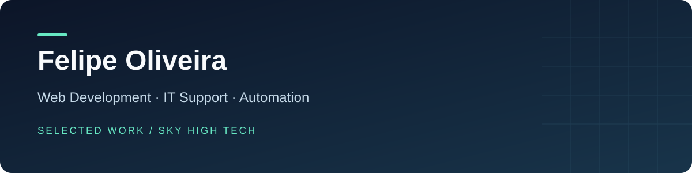

# Selected Work · Felipe Oliveira

I build web interfaces and digital tools through **Sky High Tech**, with a background in IT support, motion design and audiovisual production. This portfolio connects that experience to concrete project workflows and technical decisions.

**Sorocaba, Brazil · Portuguese: native · English: intermediate**  
[LinkedIn](https://www.linkedin.com/in/fehzoliver/) · [GitHub profile](https://github.com/fehhzz)

## Explore the projects

| Project | What it demonstrates | Technologies | Case study |
| --- | --- | --- | --- |
| **Sky High Tech** | Website, lead API, authentication and administration | Next.js, TypeScript, Prisma, PostgreSQL, Better Auth | [Read](sky-high-tech.md) |
| **Kathellyn Cruz Studio** | Scheduling rules, manual approval and admin workflows | React, TanStack Start, PostgreSQL, PGlite | [Read](kathellyn-booking.md) |
| **Gabrielle Castilho Studio** | Service presentation and appointment requests | Next.js, TypeScript, Supabase | [Read](gabrielle-studio.md) |
| **RW Wear** | Catalog navigation, filtering and contact-based purchase flow | HTML, CSS, JavaScript, Supabase | [Read](rw-wear.md) |
| **Ludmila Tavares Lash Studio** | Responsive editorial design, galleries and contact journey | React, TypeScript, TanStack Start, Tailwind CSS | [Read](ludmila-studio.md) |
| **Lead Hunter Pro** | Modular research, local CRM, enrichment and export | Python, Streamlit, pandas, Node.js | [Read](lead-hunter.md) |
| **SKY-OS** | Portable knowledge, agent context and documented governance | Markdown, Skills, PowerShell | [Read](sky-os.md) |

## Professional focus

- **Web development:** responsive interfaces, forms, APIs, data persistence and administrative tools.
- **IT support:** user support, hardware/software diagnosis, Windows and Microsoft tools, networks, GLPI and Zabbix.
- **Automation:** Python workflows, system integration and AI-assisted tools.
- **Creative technology:** motion design, video editing and audiovisual experience.

I am interested in remote opportunities in web development, technical support and automation. My English is strongest in reading, technical documentation and written communication.

## About this portfolio

These are project summaries grounded in the current repositories. They distinguish implemented features from prototypes and remaining configuration. Operational source repositories remain private while publication is reviewed; this repository provides public technical case studies, not access to client data, credentials or internal company context.

The projects are independent Sky High Tech work; this collection does not imply enterprise-scale deployments, commercial performance metrics or independently verified production readiness. A walkthrough can focus on interfaces, architecture and development decisions.

## Em português

Sou **Felipe Oliveira**, de Sorocaba, com formação em Engenharia da Computação e Produção Audiovisual. Minha trajetória reúne suporte de TI na Eletromídia, experiência com motion design e projetos independentes de desenvolvimento web e automação pela Sky High Tech.

Os estudos acima mostram o problema de cada projeto, a estrutura implementada e as decisões técnicas. Busco oportunidades remotas em desenvolvimento, suporte técnico e automação, com interesse em continuar aprofundando integração de sistemas e soluções digitais.
